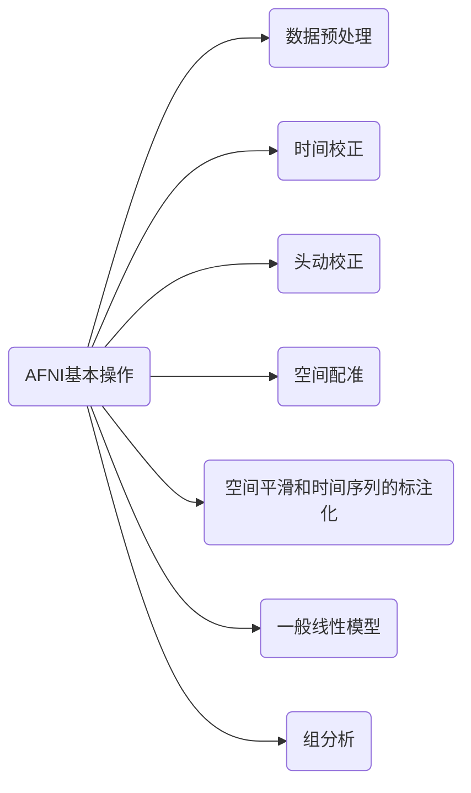

{}
在fMRI相关分析软件中，AFNI是最难学习的，如果第一次没学懂，咱多看看、多实践，不用害怕去尝试它。
{}

### 介绍
AFNI (Analysis of Functional NeuroImages)是一个领先的功能神经图像分析软件套件，包含 C、Python、R 程序和 shell 脚本，主要开发用于分析和显示多种 MRI 模态：解剖、功能 MRI (FMRI) 和扩散加权 (DWI) 数据。它是免费提供的（作为开源代码和预编译的二进制文件）用于研究目的。该软件几乎可以在任何带有 X11 和 Motif 显示的 Unix 系统上运行。为 MacOS 和 Linux 系统提供二进制包，例如 Fedora、CentOS/Red Hat 和 Ubuntu（包括用于 Linux 的 Windows 子系统）。

### AFNI能解决什么问题？

APQC: afni_proc.py质量控制
帮助研究者检查已处理过的数据。

### 时间校正
   在MRI扫描过程中，有两种方法：

   1. 顺序切片采集
      按照顺序从上到下、从下到上进行采集。

   2. 交错切片采集
     每采集一张切片后隔一张再采集，然后第二遍进行间隙填充。

   即从扫描开始的第一个切片到最后一个切片之间存在一定的时间差，导致采集到的数据并不是同一个时间点。

脚本：`3dTshift`

### 配准与标准化
每个人的大脑存在差异，在进行组分析时，需要将个体的大脑体素都对应到相同的大脑模板上再进行分析。

脚本：`align_epi_anat.py`

### 对准和运动校正
在MRI扫描过程中，被试头部可能存在轻微扰动，对于成像结果造成干扰，故我们需要对头动进行校正。

刚体变换：采用刚体变换来解决头动问题，如果我们设定一个参考点，然后检测到受试者的头部向哪个方向移动了，那么我们只需要将图像的切片向相反的方向移动同样的距离即可，当然，不只是平移，包括旋转等。

脚本：`volreg`

### 平滑
平滑就是用周围体素的平均值代替当前体素，这对使得图像变得模糊，分辨率降低。但是平滑对与fMRI来说是非常有效的，因为fMRI的噪音较大，平滑后可以显著降噪，同时增强信号。平滑核函数一般包括两个：4mm和10mm，越大的核函数平滑程度更大，当然图像分辨率也越低。

脚本：`blur`

### mask和体素缩放
- mask
设置一个掩膜(mask)只把头部纳入进来，其余部分都去掉。去结构像的mask，然后应用到功能像上。

- 体素缩放
不同受试者的图像之间像素强度可能存在差异，这样的分析结果不会有任何意义，所我我们将每个体素的时间序列缩放为100的平均值（范围0-200）。

脚本：`3dAutomask`

### 检查预处理结果

数据准备：
https://openneuro.org/datasets/ds000102/versions/00001

### 参考资料
- [AFNI官网文档](https://afni.nimh.nih.gov/pub/dist/doc/htmldoc/index.html)
- https://www.cnblogs.com/kongmaster/p/16635637.html

