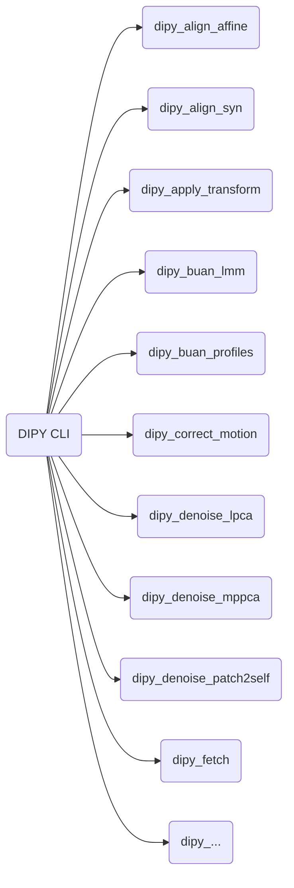

### 命令行工具总览

[DIPY Command Line Utilities Reference官网参考地址](https://dipy.org/documentation/1.5.0/reference_cmd/#workflows-reference)

[DIPY Workflows Interfaces](https://dipy.org/documentation/1.5.0/interfaces/)
