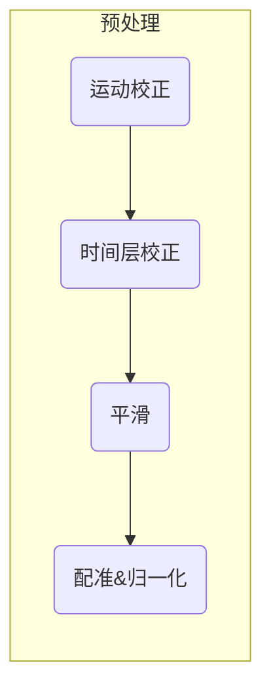

- [简介](#简介)
- [步骤一： Brain Extraction(颅骨去除，skullstripping)](#步骤一-brain-extraction颅骨去除skullstripping)
  - [步骤一：如何使用bet命令行的方式去除颅骨](#步骤一如何使用bet命令行的方式去除颅骨)
  - [如何修复效果差的颅骨去除](#如何修复效果差的颅骨去除)
- [步骤二：基于FEAT的预处理(汇总)](#步骤二基于feat的预处理汇总)
  - [运动校正（Motion Correction）](#运动校正motion-correction)
  - [时间层校正，Slice-Timing Correction](#时间层校正slice-timing-correction)
  - [平滑，Smoothing](#平滑smoothing)
  - [配准和归一化：](#配准和归一化)
    - [仿射变换（Affine Transformations）](#仿射变换affine-transformations)
    - [配准与归一化（Registration and Normalization）](#配准与归一化registration-and-normalization)
  - [预处理检查](#预处理检查)
    - [检查配准与归一化](#检查配准与归一化)
    - [检查运动伪迹](#检查运动伪迹)
- [参考](#参考)


{}
许多示例都是从`Flanker/sub-08`目录运行的,所以推荐使用`sub-08`数据进行分析计算。
{}

### 简介
对fMRI数据进行预处理时发现，一个fMRI volume不仅包含我们感兴趣的信号--含氧血液的变化，还包含我们不感兴趣的波动，如头部运动（head motion）、随机漂移(random drifts)、呼吸(breathing)和心跳(heartbeats)。我们把这些其他波动称为**噪声**，因为我们想把它们与我们感兴趣的信号分开。其中一些可以通过建模从数据中回归出来，另一些可以通过预处理减少或去除。

接下来，我们开始对sub-08’s的数据进行预处理。


### 步骤一： Brain Extraction(颅骨去除，skullstripping)
由于fMRI研究的重点是大脑组织，我们的第一步是将头骨和非大脑区域从图像中移除。FSL有一个名为`bet`的工具，即大脑提取工具。它是FSL图形用户界面上列出的第一个按钮（BET brain extraction,在下图中用 "A "表示）。如果你点击这个按钮，就会打开另一个窗口，允许你指定输入图像来进行头骨剥离，以及对已进行头骨剥离的输出图像进行标注（B），还有一个可扩展的子窗口，允许你指定高级选项（C）。


{}
对于BET和许多其他FSL工具，你需要指定一个输入图像和一个输出图像的标签： 在输入图像上进行一些操作（例如头骨剥离），输出图像是该操作的结果。通常情况下，其他选项被设置为默认值，对大多数数据集都很有效，但如果你想的话，你可以覆盖它们。
{}

从sub-08目录下打开FSL GUI(比如，进入该目录后，打开终端，输入`fsl`命令，启动FSL GUI)，点击输入图像栏旁边的文件夹图标，并导航到anat目录。选择文件sub-08_T1w.nii.gz并点击确定按钮。请注意，输出图像字段是自动填写的，在你的输入图像上附加了大脑这个词，这是FSL的默认值。如果你愿意，你可以改变这个名字，但在本教程中我们将保持原样。

现在点击窗口底部的 "Go"按钮。你会看到一些文本被写入你的终端，显示哪些命令被用来运行一个叫做`bet2`的命令。花点时间看看GUI是如何与终端对应的--稍后我们将利用这一点，通过GUI创建一个模板，然后在终端中对其进行修改，以自动预处理我们数据集中的所有对象。


当终端显示 "Finished "时，bet2就完成了。由于你已经创建了一个新的图像，我们应该看一下数据。在之后的每个预处理步骤之后，都建议看一下处理完成的数据，检查一下数据被处理后的质量。


<center>sub-08被试的结构像数据展示</center>

---------


<center>sub-08被试的结构像数据被去除颅骨后的展示</center>

---------


<center>sub-08被试的结构像数据叠加去除颅骨后的数据（红黄色）展示</center>

---------


**BET整体操作录屏**

<center>示范如何使用BET来检查剥离头骨前后的解剖图像。</center>

点击GUI底部的FSLeyes按钮。当它打开时，点击`FILE -> Add from File`，并按住`shift键`选择原始的解剖图像和你刚刚创建的头骨去除图像。正如你在前一章中所看到的，你要改变**对比度**以清楚地区分灰质和白质。

通过加载这两幅图像，你可以比较头骨被移除之前和之后的图像。在FSLeyes左下角的叠加列表面板中，点击 "眼睛"图标来隐藏相应的图像。例如，如果你点击sub-08_T1w旁边的眼睛图标，原来的T1解剖图像将变得不可见，而你将只看到被头骨剥离的大脑。如果你再次点击眼睛，你将看到原始的T1。为了使大脑之间的差异更加明显，在叠加列表面板中突出显示头骨剥离的图像，然后将**对比度**从灰度改为蓝光蓝（或者其他想要呈现的颜色）。上面的动画告诉你如何做到这一点。


{}

在2019年11月发布的fsleyes中，一些用户在试图加载由任何FSL命令生成的图像时，会遇到以下错误信息： "Error loading overlay: Does not look like a BIDS file."。如果你得到这个错误信息，请尝试将anat和func目录中的.json文件移到一个单独的文件夹中，然后再次尝试加载图像。

{}

用鼠标点击图像周围，观察哪里有太多的大脑或太少的头骨被移除。请记住，我们正试图创建一个头骨和脸部被剥离干净的图像，只剩下大脑（如皮质（cortex）、皮质下结构（subcortical structures）、脑干(brainstem)和小脑(cerebellum)）。

#### 步骤一：如何使用bet命令行的方式去除颅骨
```
# 可以实现和GUI一致的效果，其中-f即表示fractional intensity threshold;
$ bet2 sub-08_T1w.nii.gz  sub-08_T1w_brain -f 0.5 -g 0
```

{}
【参数自动补全&提示】我们在使用fsl命令时，命令参数过多、过长，不容易记住，建议可以自己完善一份zsh-completion或者bash-completion，可以在写fsl命令时，使用tab键，自动补全参数以及提示参数含义。

{}


#### 如何修复效果差的颅骨去除
如果对上述颅骨去除不满意，我们能做什么？回顾一下，BET窗口包含了一些选项，如果我们喜欢的话，可以改变这些选项。其中一个字段，标记为分数强度阈值（`Fractional intensity threshold`），默认设置为0.5。旁边的文字解释说，**较小的值会给出较大的大脑轮廓估计值,反之，较大的值会给出较小的大脑轮廓估计值**。换句话说，如果我们认为有太多的大脑被移除，我们应该把这个值设置为一个较小的数字，反之亦然，如果我们认为有太多的头骨被移除。

假如BET已经删除了太多的大脑，所以我们尝试将分数强度阈值降低到0.2（即Fractional intensity threshold）。还要确保将输出名称改为有助于记住你所做的事情的名称--例如，sub-08_T1w_brain_f02。点击 "Go"按钮，重新运行头骨剥离。

当它完成后，在FSLeyes中加载最新的去除颅骨后的图像。点击原始解剖图像旁边的眼睛图标，同时点击我们刚刚创建的最新的头骨剥离图像旁边的眼睛图标。注意哪些地方保留了更多的皮层，特别是在额叶皮层和顶叶皮层。你可能还注意到，在这幅图像中保留了更多的硬脑膜（dura）和头骨碎片。**一般来说，最好是保留过多的头骨，而不是去除过多的皮质**--这里和那里的头骨碎片不会导致未来的预处理步骤失败（如normalization），但一旦皮质被去除，就无法恢复它。


### 步骤二：基于FEAT的预处理(汇总)

{}
在FEAT使用前，需要使用BET对结构像数据进行颅骨去除，以便作为配准中的"高分辨率 "图像使用。
{}



其余的预处理步骤（通过normalization进行运动校正(motion correction)）将在FEAT GUI中进行。FEAT按钮位于FSL GUI菜单的中间，点击它将打开一个有几个标签的窗口。


点击**FEAT FMRI**分析按钮（A）可以打开FEAT GUI。现在，我们将重点关注`Data`、`Pre-stats`和`Registration`选项卡，它们对数据进行预处理。从右上角的下拉菜单（B），选择`Preprocessing`。这将使 "Stats"和 "Post-stats"标签变灰，让我们只关注预处理。点击`Select 4D data`,选择4D数据按钮（C），加载影像数据（在这个例子中，使用sub-08_task-flanker_run-1_bold.nii.gz，它在func目录下）。这将打开一个新的窗口（D），其中有一个文件夹图标，允许你选择一个功能成像数据运行（E）。

当加载一个功能图像时，FSL会从该图像的头部读取信息。可以把图像本身看作是一个三维的数字矩阵，高的数字比低的数字更亮。这种对比使我们能够区分图像中的不同结构。另一方面，**header**（影像数据的头文件信息）包含了你在图像中没有直接看到的信息，但为了显示它，这些信息是必要的，例如，方向。四维数据（即包含多个volumes的单一数据集）的**header**也包含表示TR和volumes的数量。

在加载输入数据后，这些字段将被自动输入到FEAT GUI的相应字段中，如以下视频所示：

<center>请确保检查TR和Volumes数量是否与扫描仪上获得的数据相符。如果对所使用的参数有任何疑问，请询问相关扫描技术员。</center>

{}
**Delete volumes**：控制在任何进一步处理之前要删除的初始功能像volume的数量。  
**TR**:重复时间(单位：秒)，表示扫描一个volume后到下一个volume之间的间隔时间。  
**High pass filter cutoff**:（单位：秒）控制你将允许的最长时间段。  
[详见fsl官网](https://fsl.fmrib.ox.ac.uk/fsl/fslwiki/FEAT/UserGuide)
{}


<center>FEAT产生的HTML报告</center>

接下来的两个选项卡，`Pre-stats`和`Registration`，将在后续讨论。

#### 运动校正（Motion Correction）

如果受试者在移动，图像会看起来很模糊；如果受试者是静止的，图像会看起来更清晰。但这还不是全部：如果被试者经常移动，我们也有可能从移动的体素上测量信号。这样，我们就有可能在实验的一部分时间里测量来自该体素的信号，而在受试者移动后，则测量来自不同区域或组织类型的信号。

最后，运动会给成像数据带来干扰，因为运动会产生信号。如果受试者每次对刺激做出反应时都会移动--例如，如果他每次感觉到电击时都会扭头，那么就不可能确定我们测量的信号是对刺激的反应，还是因为运动。

"撤销"这些运动的一种方法是通过刚体转换(**rigid-body transformations**)。为了说明这一点，拿起附近的一个物体：例如，一个电话或一个咖啡杯。把它放在你面前，并在心里标记它的位置，这就是参考点（**reference point**）。然后将该物体向左移动一英寸，这被称为平移（**translation**），这意味着向左或向右、向前或向后、向上或向下的任何移动。如果你想让物体回到它开始的地方，你只需将它向右移动一英寸。

同样，如果你把物体向左或向右旋转，你可以通过向相反的方向等量旋转来撤销。这些被称为旋转(**rotations**)，和平移一样，它们有三个自由度，或者说它们可以移动的方式：围绕X轴（也称为俯仰，或向前和向后倾斜），围绕Y轴（也称为滚动，或向左和向右倾斜），以及围绕Z轴（或偏航，如摇头 "不"）。

我们对功能像数据的volumes做同样的操作，把我们时间序列中的第一个volume称为**reference volume**（**参考点**）。如果在扫描过程中，我们的受试者将他的头向右移动了一英寸，我们可以检测到这种移动，并通过将该volume向左移动一英寸来消除它。我们的目标是检测任何一个volume的移动，并将这些volume与参考volume重新对齐（**realgin**）。


**reference volume**可以是时间序列中的任何volume（尽管它通常是第一、中间或最后一个volume）。如果在扫描过程中，受试者向右移动，该运动可以通过参考**reference volume**做相反的运动来 "消除 "。

在FEAT的图形用户界面中，运动校正是在`Pre-stats`标签中指定的。FEAT默认使用FSL的**MCFLIRT**工具，你可以在下拉菜单中看到它。你可以选择关闭运动校正，但除非你有理由这样做，否则请保持原样。


#### 时间层校正，Slice-Timing Correction
整个照片是在一瞬间拍摄完成的，而fMRI的volume是分片（slices）获取的。每个切片都需要时间来获取（从几十到几百毫秒）。

两种最常用的创建volume的方法是顺序和交错的切片采集。顺序切片采集是连续采集每个相邻的切片，从下到上或从上到下。交错式切片采集每一个间隔的切片，然后在第二遍的时候填补空隙。这两种方法在下面的视频中都有说明。


正如在后面看到的，当我们对每个体素的数据进行建模时，我们假设所有的切片（slices）是同时获得的。为了使这一假设有效，每个切片的时间序列需要在时间上向后移动，即获取该切片所需的时间。Sladky等人（2011年）还证明，对于TR较长（如2s或更长）的研究，尤其是大脑背侧区域的研究，切片时间校正可使统计能力显著提高。

**尽管时间层校正似乎是合理的，但也有一些反对意见**：
- 一般来说，除非需要，否则最好不要对数据进行插值（即编辑）；
- 对于短的TR（例如，大约1秒或更短），时间层校正似乎不会导致统计能力的任何明显提高；
- 许多由时间层校正解决的问题可以通过在统计模型中使用时间导数（**temporal direivate**）来解决（在后面关于模型拟合的章节中讨论）。
  
**FSL的默认设置是不做时间层校正**，而是包含一个时间导数。稍后，我们将做一个练习，比较有无切片时间层校正的数据，以观察它的差别有多大。


#### 平滑，Smoothing

常见的做法是对fMRI数据进行平滑处理，或将每个体素的信号替换为该体素邻近区域的加权平均。这初看起来很奇怪--为什么我们要使图像比原来更模糊？

的确，平滑化会降低fMRI数据的空间分辨率，而我们并不希望分辨率降低。但平滑化也有好处，这些好处可以超过缺点。例如，**我们知道fMRI数据包含很多噪音，而且噪音经常大于信号。通过对附近的体素进行平均化，我们可以消除噪音并增强信号。**


<center>在这个动画中，两个不同的平滑核（4毫米和10毫米）被应用于一个fMRI扫描。请注意，随着我们使用更大的平滑核，图像变得更加模糊，解剖细节变得不那么明显。还要注意的是，为了简单起见，这个动画使用大脑的二维切片来演示这个预处理步骤。在实际的fMRI数据中，内核将应用于所有三个维度。</center>

平滑化还有一个好处。正如你将在下一节看到的，我们的目标是将每个受试者的大脑归一化到一个具有标准化坐标的模板大脑上。

#### 配准和归一化：
虽然大多数人的大脑是相似的--例如，每个人都有扣带回（cingulate gyrus）和胼胝体(corpus callosum)--但在大脑的大小和形状上也有差异。因此，如果我们想做一个群体分析(group analysis)，我们需要确保每个受试者的每个体素都对应于大脑的同一部位。例如，如果我们要测量视觉皮层中的一个体素，我们要确保每个受试者的视觉皮层都是一致的。

这是通过对图像进行配准(**Registering**)和归一化(**Normalizing**)来实现的。就像你要折叠衣服以装入行李箱一样，每个大脑都需要被转换为具有相同的大小、形状和尺寸。我们通过归一化（或扭曲）到模板来实现这一目标。模板是一个具有标准尺寸和标准坐标的大脑，因为大多数研究人员都同意在报告他们的结果时使用它们。这样一来，如果你将你的数据归一到该模板，并在坐标X=3、Y=20、Z=42处发现了一个效应，那么其他将他们的数据扭曲到同一模板的人可以将他们的结果与你的结果进行对照。模板大脑的尺寸和坐标也被称为**标准化空间（standardized space）**。


<center>一个常用的模板的例子，MNI152脑模板。这是152个健康成人大脑的平均值，代表了大多数研究的人群。如果你正在研究其他人群--例如儿童或老年人--考虑使用从该人群的代表中创建的模板。</center>

##### 仿射变换（Affine Transformations）

为了将图像扭曲成一个模板，我们将使用一个仿射变换(**Affine transformation**)。这类似于上面运动校正中描述的刚体变换，但它又增加了两个变换：**缩放(zooms)和错切(shear)**。**平移**和**旋转**对于像笔这样的日常物体来说是很容易做到的，而缩放和错切则更不寻常--缩放可以缩小或放大图像，而错切则是将图像的对角线相对的角拉开。下面的动画总结了这四种类型的线性变换。


{}
与刚体变换一样，缩放和错切都有三个自由度： 你可以沿x轴、y轴或z轴缩放或错切图像。那么，总的来说，仿生变换有12个自由度（（平移、旋转、缩放、错切）* （x、y、z）= 4 * 3= 12）。这些也被称为线性变换，因为沿轴的一个方向应用的变换会伴随着相反方向的等量变换。例如，向左平移一毫米，意味着图像从右边移动了一毫米。同样地，如果一个图像沿Z轴放大一毫米，它就会沿该轴的两个方向放大一毫米。没有这些约束的变换被称为非线性变换。例如，非线性变换可以在一个方向上放大图像，而在另一个方向上缩小图像，就像挤压海绵时一样。这些类型的变换将在后面讨论。
{}

##### 配准与归一化（Registration and Normalization）
回顾一下，我们的数据集中既有解剖学图像，也有fMRI图像。我们的目标是将fMRI图像变换到模板上，这样我们就可以对所有的受试者进行组分析。虽然简单地将fMRI图像直接翘曲到模板上似乎是合理的，但在实践中，这样做效果并不好--图像是低分辨率的，因此不太可能与模板的解剖细节相匹配。解剖图像是一个更好的选择。

虽然这似乎对我们实现目标没有帮助，但事实上，对解剖图像进行扭曲可以帮助将fMRI图像带入标准化的空间。**请记住，解剖和功能扫描通常是在同一时段获得的**，而且在两次扫描之间，受试者的头部几乎没有移动。如**果我们已经将解剖图像规范化为一个模板，并记录了所做的转换，我们就可以将同样的转换应用于fMRI图像--只要它们与解剖图像在同一位置开始。**

这种功能图像和解剖图像之间的对位被称为配准。大多数配准算法使用以下步骤：

1. 假设功能图像和解剖图像处于大致相同的位置。如果它们不在同一位置，则对准图像的轮廓。
2. 利用解剖图像和功能图像具有不同的对比度权重这一事实--也就是说，在解剖图像上图像较暗的区域（如脑脊液）在功能图像上会显得明亮，反之亦然。这被称为相互信息（**mutual information**）。配准算法移动图像以测试解剖和功能图像的不同重叠，将一个图像上的明亮体素与另一个图像上的黑暗体素相匹配，将黑暗体素与明亮体素相匹配，直到找到一个无法改进的匹配。
3. 一旦找到了最佳匹配，然后将用于将解剖图像与模板进行扭曲的相同转换应用于功能图像。


**归一化、平滑、统计功效(Normalization,Smoothing, and Statistical Power)**

正如在上一页讲述的那样，平滑处理倾向于消除噪音和增强信号。这也适用于群体分析，在这种情况下，所有受试者的图像都被规范化为一个模板。尽管每个受试者的功能图像将被转换为与模板的一般形状和大的解剖学特征相匹配，但较小的解剖学区域在归一化的功能图像中的排列方式会有差异。如果图像被平滑化，信号簇之间会有更多的重叠，因此更有可能检测到一个显著的影响。

**基于FEAT GUI的配准操作**
配准（Registration）和归一化(Normalization)虽然不同，但在FEAT GUI的配准标签中被打包成一个步骤。一旦你选择了这个选项卡，点击主结构图像(`Main structual image`)旁边的框选按钮来扩展输入区域。然后选择受试者的**头骨剥离图像**。

我们会注意到，在主结构图像（`Main structual image`）和标准空间(`Standard space`)字段下面都有下拉菜单。
- 主结构图像字段下的菜单对应于将**功能配准到解剖图像**上的选项。
- 标准空间字段下的菜单是将**解剖图像与模板图像标准化**的选项。
在这几组菜单中，左边的下拉菜单是搜索窗口，右边的下拉菜单是自由度窗口。

在 "Search"窗口中，有三个选项： 1）不搜索(No Search)；2）正常搜索(Normal search)；和3）全面搜索(Full search)。这意味着FSL要在功能图像和解剖图像之间（用于配准）以及解剖图像和模板图像之间（用于归一化）进行多少搜索以获得良好的初始配准。完全搜索选项需要更长的时间，但更彻底，因此更可能产生更好的配准和规范化。

在自由度窗口，您可以使用3、6或12个自由度来转换图像。配准有一个额外的选项，BBR，代表脑边界配准(Brain-Boundary Registration)。这是一种更先进的配准技术，使用组织边界来微调功能图像和解剖图像之间的排列。与上面的全面搜索选项类似，它需要更长的时间，但往往能得到更好的配准。

现在，将两个搜索选项都设置为完全搜索，两个自由度选项都设置为12自由度。**如果你已经在 "Data"选项卡中加载了你的功能图像，点击 "Go"按钮来运行所有的预处理步骤。**


配准和归一化是单个被试预处理Pipeline的最后一步。


#### 预处理检查
就像我们在处理颅骨去除（skull-stripped）图像时一样，我们将在使用FEAT GUI在处理它们之前和之后检查我们的数据。在你点击 "Go"按钮后，会自动弹出浏览器页面，展现像下面这样的HTML页面，会展示出每一步的进展。


##### 检查配准与归一化
由于我们只做预处理，我们将只有配准（Registration）和预统计(Pre-stats)标签的结果。点击 "Registration"选项卡，检查每个配准和归一化步骤的结果。如果你向下滚动页面，你应该看到看起来像这样的图像：


每张图片都是将一个大脑的红色轮廓（结构像数据）叠加到另一个大脑的灰度图像（功能像数据）上。第一幅图，"Summary Registration"，显示了一个有代表性的功能像图像--在这种情况下，**fMRI时间序列中的中值图像--作为底层，而模板大脑作为红线**。报告首先显示的是这幅图像，因为如果之前的配准或归一化步骤有任何问题，这幅图像就会出现明显的错误，比如图像偏斜或大部分在红色轮廓之外。

寻找红色轮廓是否近似于追踪灰度图像的轮廓。还要检查图像的一些内部结构，如脑室（ventricle），是否对齐。对其他排列进行同样的质量检查，如功能图像的例子与高分辨率图像（即解剖图像）的配准，以及高分辨率图像（highres image）与标准空间模板的标准化。

##### 检查运动伪迹

当你看完配准页面后，点击"Pre-stats"链接。如果你向下滚动，你会看到该运行的时间序列中的运动图，**X轴上标明体积，Y轴上标明运动量（以毫米为单位）**。

检查运动图中的峰值是否大于体素分辨率的一半，以及漂移是否大于整个体素的大小。如果有超过半个体素的相对运动或超过一个体素的绝对运动，你可能要考虑更高级的校正技术，如scrubbing，或从分析中完全删除这个`run`。因此，如果我们获得了一个3×3×3毫米体素分辨率的体积，将标记任何体积与体积之间相对运动超过1.5毫米，或整个`run`中绝对运动超过3毫米的`run`。这些只是参考，我们可以根据自己所研究的人群来决定改变这些。

------


{}
不同的软件会以稍微不同的顺序进行这些步骤--例如，FSL会在模型拟合后对统计图(statistical maps)进行归一化。还有一些分析省略了某些步骤--例如，一些做多体素模式分析(multi-voxel pattern analyses)的人不平滑他们的数据。在任何情况下，上面的清单代表了在一个典型的数据集上所进行的最常见的步骤。
{}


{}
相关的fmri的预处理操作，也可以采取开源的`fmriprep`工具箱，完成对功能像数据的预处理操作，详见官网或者[fmriprep教程]()
{}

### 参考
- https://andysbrainbook.readthedocs.io/en/latest/fMRI_Short_Course/fMRI_04_Preprocessing.html
- https://fsl.fmrib.ox.ac.uk/fsl/fslwiki/FEAT/UserGuide