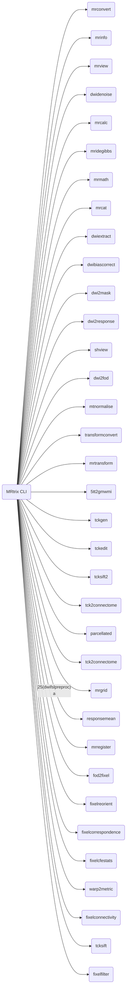

#### 命令行总览



##### 1. 如何从4D的扩散像中抽取任意的3D数据？
```
# 使用mrconvert命令
# -force 表示可以强制覆写文件
# -coord 3 0 表示在第3个维度（coord从0开始计数，即3表示时间维度），提取volume索引为0的数据;（-coord 3 <#> selects volumes (the fourth dimension) from the series; -axes 0,1,2 includes only the three spatial axes in the output image.）
# -axes 0,1,2 表示在输出图像中仅包含三个空间轴。
$ mrconvert -force -coord 3 0 -axes 0,1,2 <input data> <output data>
$ mrconvert -force -coord 3 0  -axes 0,1,2 sub-02_den_preproc_unbiased.mif sub02_1.nii
```

##### 2. mrcalc的-if判断使用
```
# 如何使用mrcalc的-if判断条件
#    -if  (multiple uses permitted)
#     (%1 ? %2 : %3) : if first operand is true (non-zero), return second operand, otherwise return third operand
# mrcalc %1 %2 %3 -if <最终结果保存>
$ mrcalc test.mif 0 eroded_mask.mif -if demo.mif
mrcalc: [100%] computing: (test.mif ? 0 : eroded_mask.mif)
```

#### 参考资料
- https://mrtrix.readthedocs.io/en/dev/reference/commands_list.html