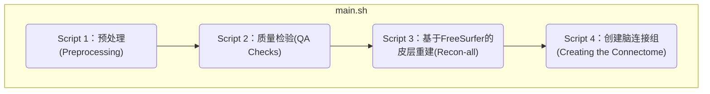

- [简介](#简介)
- [脚本模板](#脚本模板)
- [脚本模板代码解析](#脚本模板代码解析)
- [最终汇总的脚本(main.sh)](#最终汇总的脚本mainsh)
- [参考](#参考)


#### 简介
在我们对单个受试者的单次run进行预处理并建立模型后，你需要对数据集中的所有受试者的所有runs做同样的步骤。这看起来很繁琐，但也是可以做到的--我们只有42个受试者，每个受试者有一次扩散数据的运行，但这样手动处理会耗费大量的时间，而且会碰到下述问题：
1. 手动分析每一次运行不仅繁琐，而且容易出错，而且随着要分析的运行数量的增加，出错的概率也会大大增加；
2. 对于较大的数据集--例如，80个受试者，每个受试者有5次运行--这种方法很快就变得不切实际。

为解决上述手动挨个处理的问题，最好的办法是自己编写分析脚本。就像一个演员有一个脚本，告诉他说什么，站在哪里，在哪里移动，你也可以写一个脚本，告诉你的计算机如何分析你的数据集。这样做有两个好处，一是使你的分析自动化，二是能够分析任何规模的数据集--分析两个受试者或两百个受试者的代码几乎是相同的。


首先，我们将创建一个模板，其中包含分析一次运行所需的所有代码，然后我们将使用一个for-loop来自动分析所有的运行。这个想法很简单；尽管代码一开始可能很难理解，但一旦你对它更加熟悉，你就会发现你可以把它应用于任何数据集。

#### 脚本模板
为我们的分析编写脚本的最简单方法是将我们的所有命令复制并粘贴到一个文本文件中，然后从命令行中运行。这或多或少是我们要做的；唯一的变化是包括参数，用户可以用所需的文件来填入这些参数。然后我们可以把它放在一个循环中，对我们数据集中的所有受试者运行。(前提是有linux相关的shell基础)




现在，我们将为一个单一的被试进行分析。该脚本将分四部分编写：

1. 第一个脚本将执行所有的预处理，从去噪到`tcksift2`；
2. 第二个脚本将对每个主要的预处理输出进行质量保证检查；
3. 第三个脚本将使用`recon-all`对结构图像进行预处理；以及
4. 最后一个脚本将创建连接组。


#### 脚本模板代码解析

{}
```shell
#!/bin/bash
# 01_MRtrix_Preproc_AP_Direction.sh

# Written by Andrew Jahn, University of Michigan, 02.25.2019
# Updated 07.10.2020 to incorporate changes from MRtrix version 3.0.1
# Based on Marlene Tahedl's BATMAN tutorial (http://www.miccai.org/edu/finalists/BATMAN_trimmed_tutorial.pdf)
# The main difference between this script and the other one in this repository, is that this script assumes that your diffusion images were acquired with AP phase encoding
# Thanks to John Plass and Bennet Fauber for useful comments

# For example：
# bash 01_MRtrix_Preproc_AP_Direction.sh sub-CON03_ses-preop_acq-AP_dwi.nii.gz sub-CON03_ses-preop_acq-PA_dwi.nii.gz \
# sub-CON03_ses-preop_acq-AP_dwi.bvec sub-CON03_ses-preop_acq-AP_dwi.bval \
# sub-CON03_ses-preop_acq-PA_dwi.bvec sub-CON03_ses-preop_acq-PA_dwi.bval \
# ../anat/sub-CON03_ses-preop_T1w.nii.gz

#####展示本脚本的使用方法 ######
display_usage() {
	echo "$(basename $0) [Raw Diffusion] [RevPhaseImage] [AP bvec] [AP bval] [PA bvec] [PA bval] [Anatomical]"
	echo "This script uses MRtrix to analyze diffusion data. It requires 7 arguments: 
		1) The raw diffusion image;
		2) The image acquired with the reverse phase-encoding direction;
		3) The bvec file for the data acquired in the AP direction;
		4) The bval file for the data acquired in the AP direction;
		5) The bvec file for the data acquired in the PA direction;
		6) The bval file for the data acquired in the PA direction;
		7) The anatomical image"
	}
# 如果本脚本的输入参数个数小于等于6，则会默认调用display_usage函数，输出本脚本的使用方法。
	if [ $# -le 6 ]
	then
		display_usage
		exit 1
	fi

# 获取输入参数
RAW_DWI=$1
REV_PHASE=$2
AP_BVEC=$3
AP_BVAL=$4
PA_BVEC=$5
PA_BVAL=$6
ANAT=$7


########################### STEP 1 ###################################
#	        Convert data to .mif format and denoise	   	     #
######################################################################

# Also consider doing Gibbs denoising (using mrdegibbs). Check your diffusion data for ringing artifacts before deciding whether to use it
# 转换数据到mif格式
mrconvert $RAW_DWI raw_dwi.mif -fslgrad $AP_BVEC $AP_BVAL
# 去噪
dwidenoise raw_dwi.mif dwi_den.mif -noise noise.mif

# Extract the b0 images from the diffusion data acquired in the AP direction
dwiextract dwi_den.mif - -bzero | mrmath - mean mean_b0_AP.mif -axis 3

# Extracts the b0 images for diffusion data acquired in the PA direction
# The term "fieldmap" is taken from the output from Michigan's fMRI Lab; it is not an actual fieldmap, but rather a collection of b0 images with both PA and AP phase encoding
# For the PA_BVEC and PA_BVAL files, they should be in the follwing format (assuming you extract only one volume):
# PA_BVEC: 0 0 0
# PA_BVAL: 0
# 转换PA方向的数据到mif格式，并取b0的均值
mrconvert $REV_PHASE PA.mif # If the PA map contains only 1 image, you will need to add the option "-coord 3 0"
mrconvert PA.mif -fslgrad $PA_BVEC $PA_BVAL - | mrmath - mean mean_b0_PA.mif -axis 3

# Concatenates the b0 images from AP and PA directions to create a paired b0 image
mrcat mean_b0_AP.mif mean_b0_PA.mif -axis 3 b0_pair.mif

# Runs the dwipreproc command, which is a wrapper for eddy and topup. This step takes about 2 hours on an iMac desktop with 8 cores
# eddy处理，去除涡流
dwifslpreproc dwi_den.mif dwi_den_preproc.mif -nocleanup -pe_dir AP -rpe_pair -se_epi b0_pair.mif -eddy_options " --slm=linear --data_is_shelled"

# Performs bias field correction. Needs ANTs to be installed in order to use the "ants" option (use "fsl" otherwise)
dwibiascorrect ants dwi_den_preproc.mif dwi_den_preproc_unbiased.mif -bias bias.mif

# Create a mask for future processing steps
dwi2mask dwi_den_preproc_unbiased.mif mask.mif


########################### STEP 2 ###################################
#             Basis function for each tissue type                    #
######################################################################

# Create a basis function from the subject's DWI data. The "dhollander" function is best used for multi-shell acquisitions; it will estimate different basis functions for each tissue type. For single-shell acquisition, use the "tournier" function instead
dwi2response dhollander dwi_den_preproc_unbiased.mif wm.txt gm.txt csf.txt -voxels voxels.mif

# Performs multishell-multitissue constrained spherical deconvolution, using the basis functions estimated above
dwi2fod msmt_csd dwi_den_preproc_unbiased.mif -mask mask.mif wm.txt wmfod.mif gm.txt gmfod.mif csf.txt csffod.mif

# Creates an image of the fiber orientation densities overlaid onto the estimated tissues (Blue=WM; Green=GM; Red=CSF)
# You should see FOD's mostly within the white matter. These can be viewed later with the command "mrview vf.mif -odf.load_sh wmfod.mif"
# 提取wmfod.mif的第一张图像，并与csffod.mif、gmfod.mif一起合并成vf.mif文件；
mrconvert -coord 3 0 wmfod.mif - | mrcat csffod.mif gmfod.mif - vf.mif

# Now normalize the FODs to enable comparison between subjects
mtnormalise wmfod.mif wmfod_norm.mif gmfod.mif gmfod_norm.mif csffod.mif csffod_norm.mif -mask mask.mif


########################### STEP 3 ###################################
#            Create a GM/WM boundary for seed analysis               #
######################################################################

# Convert the anatomical image to .mif format, and then extract all five tissue catagories (1=GM; 2=Subcortical GM; 3=WM; 4=CSF; 5=Pathological tissue)
mrconvert $ANAT anat.mif  #  转换结构像到mif格式
5ttgen fsl anat.mif 5tt_nocoreg.mif  # 使用基于fsl的分割方法对结构像数据进行分割

# The following series of commands will take the average of the b0 images (which have the best contrast), convert them and the 5tt image to NIFTI format, and use it for coregistration.
dwiextract dwi_den_preproc_unbiased.mif - -bzero | mrmath - mean mean_b0_processed.mif -axis 3
mrconvert mean_b0_processed.mif mean_b0_processed.nii.gz
mrconvert 5tt_nocoreg.mif 5tt_nocoreg.nii.gz

# Uses FSL commands fslroi and flirt to create a transformation matrix for regisitration between the tissue map and the b0 images
fslroi 5tt_nocoreg.nii.gz 5tt_vol0.nii.gz 0 1 #Extract the first volume of the 5tt dataset (since flirt can only use 3D images, not 4D images)
flirt -in mean_b0_processed.nii.gz -ref 5tt_vol0.nii.gz -interp nearestneighbour -dof 6 -omat diff2struct_fsl.mat
# 将变换矩阵转换成MRtrix可以读取的格式
transformconvert diff2struct_fsl.mat mean_b0_processed.nii.gz 5tt_nocoreg.nii.gz flirt_import diff2struct_mrtrix.txt
mrtransform 5tt_nocoreg.mif -linear diff2struct_mrtrix.txt -inverse 5tt_coreg.mif

#Create a seed region along the GM/WM boundary
5tt2gmwmi 5tt_coreg.mif gmwmSeed_coreg.mif

########################### STEP 4 ###################################
#                 Run the streamline analysis                        #
######################################################################

# Create streamlines
# Note that the "right" number of streamlines is still up for debate. Last I read from the MRtrix documentation,
# They recommend about 100 million tracks. Here I use 10 million, if only to save time. Read their papers and then make a decision
tckgen -act 5tt_coreg.mif -backtrack -seed_gmwmi gmwmSeed_coreg.mif -nthreads 8 -maxlength 250 -cutoff 0.06 -select 10000000 wmfod_norm.mif tracks_10M.tck

# Extract a subset of tracks (here, 200 thousand) for ease of visualization
tckedit tracks_10M.tck -number 200k smallerTracks_200k.tck

# Reduce the number of streamlines with tcksift
tcksift2 -act 5tt_coreg.mif -out_mu sift_mu.txt -out_coeffs sift_coeffs.txt -nthreads 8 tracks_10M.tck wmfod_norm.mif sift_1M.txt

```
{}

{}
```shell
#!/bin/bash

# 02_QC_mrview.sh
# These commands are for quality-checking your diffusion data


### Quality checks for Step 2 ###

# Views the voxels used for FOD estimation
echo "Now viewing the voxels used for FOD estimation (Blue=WM; Green=GM; Red=CSF)"
mrview dwi_den_preproc_unbiased.mif -overlay.load voxels.mif

# Views the response functions for each tissue type. The WM function should flatten out at higher b-values, while the other tissues should remain spherical
echo "Now viewing response function for white matter (press right arrow key to view response function for different shells)"
shview wm.txt
echo "Now viewing response function for grey matter"
shview gm.txt
echo "Now viewing response function for CSF"
shview csf.txt

# Views the FODs overlaid on the tissue types (Blue=WM; Green=GM; Red=CSF)
echo "Now viewing the FODs (Blue=WM; Green=GM; Red=CSF)"
mrview vf.mif -odf.load_sh wmfod.mif


### Quality checks for Step 3 ###

# Check alignment of the 5 tissue types before and after alignment (new alignment in red, old alignment in blue)
echo "Checking alignment between grey matter alignment before (blue) and after (red)"
mrview dwi_den_preproc_unbiased.mif -overlay.load 5tt_nocoreg.mif -overlay.colourmap 2 -overlay.load 5tt_coreg.mif -overlay.colourmap 1

# Check the seed region (should match up along the GM/WM boundary)
echo "Checking alignment of the seed region with the GM/WM boundary"
mrview dwi_den_preproc_unbiased.mif -overlay.load gmwmSeed_coreg.mif


### Quality checks for Step 4 ###

# View the tracks in mrview
echo "Now viewing the tracks in mrview (red=left-to-right; blue=bottom-to-top; green=forward-to-back)"
mrview dwi_den_preproc_unbiased.mif -tractography.load smallerTracks_200k.tck

# View the sifted tracks in mrview
# Uncomment the following line of code if you used tcksift; otherwise, tcksift2 will output a text file with weightings that are used for later commands (e.g., creating the connectome)
#mrview dwi_den_preproc_unbiased.mif -tractography.load sift_1mio.tck

cd dwifslpreproc-tmp-*
totalSlices=`mrinfo dwi.mif | grep Dimensions | awk '{print $6 * $8}'`
totalOutliers=`awk '{ for(i=1;i<=NF;i++)sum+=$i } END { print sum }' dwi_post_eddy.eddy_outlier_map`
echo "If the following number is greater than 10, you may have to discard this subject because of too much motion or corrupted slices"
echo "scale=5; ($totalOutliers / $totalSlices * 100)/1" | bc | tee percentageOutliers.txt
cd ..

```
{}


{}
```shell
#!/bin/bash
SUBJECTS_DIR=`pwd`;
# 其中sub-CON03可以替换成你想分析的任何被试 （稍后，我们将学习如何在for循环中替换它）。一旦recon-all完成（可能需要几个小时），您就可以运行最后一个脚本了。
recon-all -i ../anat/sub-CON03_ses-preop_T1w.nii.gz -s sub-CON03_recon -all
```
{}


{}
```shell
#!/bin/bash
# 03_MRtrix_CreateConnectome.sh
# For example:
# bash 03_MRtrix_CreateConnectome.sh sub-CON03

SUBJ=$1

#Convert the labels of the FreeSurfer parcellation to a format that MRtrix understands. This requires recon-all to have been run on the subject
labelconvert ${SUBJ}_recon/mri/aparc+aseg.mgz $FREESURFER_HOME/FreeSurferColorLUT.txt /usr/local/mrtrix3/share/mrtrix3/labelconvert/fs_default.txt ${SUBJ}_parcels.mif

#Unclear if the line below is needed; it seems to make the coregistration worse. Maybe it is only needed for atlases aside from the default FreeSurfer atlases
#mrtransform ${SUBJ}_parcels.mif -interp nearest -linear diff2struct_mrtrix.txt -inverse -datatype uint32 ${SUBJ}_parcels_coreg.mif

#Create a whole-brain connectome, representing the streamlines between each parcellation pair in the atlas (in this case, 84x84). The "symmetric" option will make the lower diagonal the same as the upper diagonal, and the "scale_invnodevol" option will scale the connectome by the inverse of the size of the node 
#tck2connectome -symmetric -zero_diagonal -scale_invnodevol -tck_weights_in sift_1M.txt sub-01_parcels.mif sub-01_parcels.csv -out_assignment assignments_sub-01_parcels.csv
tck2connectome -symmetric -zero_diagonal -scale_invnodevol -tck_weights_in sift_1M.txt tracks_10M.tck ${SUBJ}_parcels.mif ${SUBJ}_parcels.csv -out_assignment assignments_${SUBJ}_parcels.csv

#Creates a tract file between the specified nodes that can then be visualized in mrview. Replace the "8,10" pair after the "nodes" option with the labels in ~/mrtrix3/share/mrtrix3/labelconvert/fs_default.txt that you are interested in
#connectome2tck -nodes 8,10 -exclusive sift_1mio.tck assignments_sub-01_parcels.csv test

```
{}


{}
复制上述代码后，在本地终端新建一个文件来存储该脚本内容：`$ touch 01_MRtrix_Preproc_AP_Direction.sh`,然后再给该脚本赋予可执行权限：
`$ chmod +x 01_MRtrix_Preproc_AP_Direction.sh`,执行方式：`./01_MRtrix_Preproc_AP_Direction.sh <your parameters>`或者`bash 01_MRtrix_Preproc_AP_Direction.sh  <your parameters>`,如果不写参数，默认会输出该脚本的使用方法。
如果觉得粘贴复制麻烦，[可以直接访问该链接进行下载所有相关脚本](https://github.com/andrewjahn/MRtrix_Analysis_Scripts)。
{}


#### 最终汇总的脚本(main.sh)
建议分别运行每个脚本，以便检查每个部分的输出，尽管你可能更喜欢把所有的东西合并到一个主脚本中。在任何情况下，当你下载了每个脚本并把它们放在BTC_preop文件夹中时，你可以运行下面的for-loop，对对照组的受试者和病人组的受试者进行预处理）：



{}
```shell
#!/bin/bash
# 循环运行01_MRtrix_Preproc_AP_Direction.sh
# 故遵照上述意见，执行01_MRtrix_Preproc_AP_Direction.sh时，我们可以将下述QA checks等脚本使用#注释掉，等需要使用时在去掉注释。
for sub in sub-CON04 sub-CON05 sub-CON06 sub-CON07 sub-CON08 sub-PAT02 sub-PAT03 sub-PAT05 sub-PAT06 sub-PAT07 sub-PAT08; do
  cp *.sh ${sub}/ses-preop/dwi;
  cd ${sub}/ses-preop/dwi;
  bash 01_MRtrix_Preproc_AP_Direction.sh ${sub}_ses-preop_acq-AP_dwi.nii.gz ${sub}_ses-preop_acq-PA_dwi.nii.gz \
  ${sub}_ses-preop_acq-AP_dwi.bvec ${sub}_ses-preop_acq-AP_dwi.bval \
  ${sub}_ses-preop_acq-PA_dwi.bvec ${sub}_ses-preop_acq-PA_dwi.bval \
  ../anat/${sub}_ses-preop_T1w.nii.gz
  cd ../../..;
done

# QA checks（建议不要循环check，一次批量运行，内容过多。）
for sub in sub-CON04 sub-CON05 sub-CON06 sub-CON07 sub-CON08 sub-PAT02 sub-PAT03 sub-PAT05 sub-PAT06 sub-PAT07 sub-PAT08; do
  cd ${sub}/ses-preop/dwi;
  bash 02_QC_mrview.sh;
  cd ../../..;
done

# 循环调用recon-all
for sub in sub-CON04 sub-CON05 sub-CON06 sub-CON07 sub-CON08 sub-PAT02 sub-PAT03 sub-PAT05 sub-PAT06 sub-PAT07 sub-PAT08; do
  cd ${sub}/ses-preop/dwi;
  SUBJECTS_DIR=`pwd`; # 设置FSL的环境变量，使其计算结果保存在当前文件下；
  recon-all -i ../anat/${sub}_ses-preop_T1w.nii.gz -s ${sub}_recon -all
  cd ../../..;
done

# 循环创建脑连接组
for sub in sub-CON04 sub-CON05 sub-CON06 sub-CON07 sub-CON08 sub-PAT02 sub-PAT03 sub-PAT05 sub-PAT06 sub-PAT07 sub-PAT08; do
  cd ${sub}/ses-preop/dwi;
  bash 03_MRtrix_CreateConnectome.sh $sub
  cd ../../..;
done

```
{}


上述main.sh脚本是原作者建议分开循环运行，以便于好检测结果。如果我们想一次性批量运行，那脚本如下（省却了QA check，不好发现问题）：
```shell
#!/bin/bash
for sub in sub-CON04 sub-CON05 sub-CON06 sub-CON07 sub-CON08 sub-PAT02 sub-PAT03 sub-PAT05 sub-PAT06 sub-PAT07 sub-PAT08; do
  # 预处理
  cp *.sh ${sub}/ses-preop/dwi;
  cd ${sub}/ses-preop/dwi;
  bash 01_MRtrix_Preproc_AP_Direction.sh ${sub}_ses-preop_acq-AP_dwi.nii.gz ${sub}_ses-preop_acq-PA_dwi.nii.gz \
  ${sub}_ses-preop_acq-AP_dwi.bvec ${sub}_ses-preop_acq-AP_dwi.bval \
  ${sub}_ses-preop_acq-PA_dwi.bvec ${sub}_ses-preop_acq-PA_dwi.bval \
  ../anat/${sub}_ses-preop_T1w.nii.gz
  cd ../../..;

  # 分割结构像
  cd ${sub}/ses-preop/dwi;
  SUBJECTS_DIR=`pwd`; # 设置FSL的环境变量，使其计算结果保存在当前文件下；
  recon-all -i ../anat/${sub}_ses-preop_T1w.nii.gz -s ${sub}_recon -all
  cd ../../..;

  # 创建脑连接组
  cd ${sub}/ses-preop/dwi;
  bash 03_MRtrix_CreateConnectome.sh $sub
  cd ../../..;

done

```


#### 参考
- https://andysbrainbook.readthedocs.io/en/latest/MRtrix/MRtrix_Course/MRtrix_09_Scripting.html
