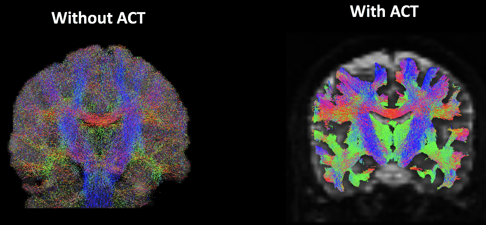

- [简介](#简介)
- [解剖学约束的纤维束成像（Anatomically Constrained Tractography,ACT）](#解剖学约束的纤维束成像anatomically-constrained-tractographyact)
- [基于tckgen生成纤维束流线(Generating Streamlines with tckgen)](#基于tckgen生成纤维束流线generating-streamlines-with-tckgen)
- [有多少条流线？](#有多少条流线)
- [使用`tcksift2`优化流线](#使用tcksift2优化流线)
- [参考资料](#参考资料)


#### 简介
在创建了白质和灰质之间的界面（Interface）后，我们准备生成流线（streamlines）--连接灰质解剖学上不同区域的线。这些是对底层白质束的估计，MRtrix使用一种概率方法来完成；为灰质/白质边界的每个体素生成大量的流线，然后根据我们指定的不同标准对这些流线进行筛选。我们将在下面讨论一些最受欢迎的选项。

#### 解剖学约束的纤维束成像（Anatomically Constrained Tractography,ACT）

MRtrix的一个特点是解剖学约束的纤维束成像，或者叫ACT（Anatomically Constrained Tractography）。这种方法只有在生物学上合理的情况下才会确定一条流线是有效的。例如，一条终止于脑脊液的流线将被放弃，因为白质束往往既起源于灰质又终止于灰质。换句话说，流线将被限制在白质中。包括或省略这一步骤的效果可以在下图中看到：


<center>没有(左)和有(右)解剖学约束的纤维束成像分析。请注意，在没有ACT的情况下，流线确实倾向于聚集在白质内；但是，大量的流线是在灰质和脑脊液中发现的。使用ACT（右图）将流线限制在我们要分析的白质束上。</center>

解剖学约束的纤维束成像不是一个单独的预处理步骤，而是一个可以包含在命令`tckgen`中的选项，它会生成实际的流线。


#### 基于tckgen生成纤维束流线(Generating Streamlines with tckgen)
MRtrix能够做确定性（**deterministic**）的和概率性(**probabillistic**)的束流图。在确定性纤维束图中，每个体素的流线方向是根据纤维取向的主方向（predominant）；换句话说，流线是由一个参数决定的。MRtrix包括多个选项来做这种确定性的束流图，如`FACT`或`tensor_det`。

另一种方法，即概率性纤维束成像，是MRtrix的默认方法。在这种方法中，沿着灰质和白质之间的边界，从种子区域生成多条流线。流线的方向很可能遵循主要的纤维取向密度，但并不总是如此；由于大量的样本，一些流线会遵循其他方向。如果FOD在一个方向上极强，这种情况就变得不太可能--例如，在胼胝体等结构内的FOD将倾向于全部从左到右排列--但在没有主导纤维方向的区域，采样变得更加多样化。

默认方法是使用称为**iFOD2**的算法，该算法将使用概率流线法。[可以在该站点找到其他算法](https://mrtrix.readthedocs.io/en/latest/reference/commands/tckgen.html)，但对于本教程的其余部分，我们将使用默认的iFOD2。

#### 有多少条流线？
生成的流线的数量和耗费的时间之间需要有一个权衡。更多的流线会使底层白质束的重建更加准确，但估计大量的流线也会花费过长的时间。

使用的"正确"流线数量仍在争论之中，但至少1000万左右应该是一个好的起点：
```
$ tckgen -h
MRtrix 3.0.4                         tckgen                          Dec 14 2022

     tckgen: part of the MRtrix3 package

SYNOPSIS

     Perform streamlines tractography

USAGE

     tckgen [ options ] source tracks

        source       The image containing the source data. The type of image
                     data required depends on the algorithm used (see
                     Description section).

        tracks       the output file containing the tracks generated.


DESCRIPTION

     By default, tckgen produces a fixed number of streamlines, by attempting
     to seed from new random locations until the target number of streamlines
     have been selected (in other words, after all inclusion & exclusion
     criteria have been applied), or the maximum number of seeds has been
     exceeded (by default, this is 1000 x the desired number of selected
     streamlines). Use the -select and/or -seeds options to modify as required.
     See also the Seeding options section for alternative seeding strategies.
...
  -cutoff value
     set the FOD amplitude / fixel size / tensor FA cutoff for terminating
     tracks (defaults: 0.1 for FOD-based algorithms; 0.1 for fixel-based
     algorithms; 0.1 for tensor-based algorithms; threshold multiplied by 0.5
     when using ACT).
...
Tractography seeding mechanisms; at least one must be provided

  -seed_gmwmi image  (multiple uses permitted)
     seed from the grey matter - white matter interface (only valid if using
     ACT framework). Input image should be a 3D seeding volume; seeds drawn
     within this image will be optimised to the interface using the 5TT image
     provided using the -act option.
...
Anatomically-Constrained Tractography options

  -act image
     use the Anatomically-Constrained Tractography framework during tracking;
     provided image must be in the 5TT (five-tissue-type) format

  -backtrack
     allow tracks to be truncated and re-tracked if a poor structural
     termination is encountered

  -crop_at_gmwmi
     crop streamline endpoints more precisely as they cross the GM-WM interface
....

# 我使用8线程，大概跑了1小时；
$ tckgen -act 5tt_coreg.mif -backtrack -seed_gmwmi gmwmSeed_coreg.mif -nthreads 8 -maxlength 250 -cutoff 0.06 -select 10000000 wmfod_norm.mif tracks_10M.tck

```
在这个命令中，"-act"选项指定我们将使用解剖学上的分割图像来约束我们的分析，使其限于白质。"-backtrack"表示如果当前的流线在一个奇怪的地方（如脑脊液）终止，则返回并再次运行同一流线；"-maxlength"设置允许的最大流线长度（体素）；"-cutoff"指定终止流线的FOD振幅（例如，0.06的值不允许流线沿着低于这个数字的FOD走）。"-seed_gmwmi "把使用5tt2gmwmi命令生成的灰质/白质边界作为输入。

"-nthreads"指定你希望使用的处理的线程数量，以加快分析速度。最后，"-select"表示要生成多少条总的流线。注意，如果你愿意，可以使用速记法；比如说，10000000，你可以改写成10000k（意思是 "一万个"，等于 "一千万"）。最后两个参数指定了输入（`wmfod_norm.mif`）和输出的标签（`tracks_10M.tck`）。


如果你想将可视化输出结果，可以通过使用`tckedit`提取输出的一个子集
```
$ tckedit tracks_10M.tck -number 200k smallerTracks_200k.tck
```
然后可以通过"-tractography.load "选项将其加载到mrview中，该选项会自动将较小的Tracks_200k.tck文件叠加到预处理的扩散加权图像上。

```
$ mrview sub-02_den_preproc_unbiased.mif -tractography.load smallerTracks_200k.tck
```
结果如图所示：
)

<center>记得检查这个图像，以确保流线在你认为应该的地方结束；换句话说，流线应该被限制在白质上，而且它们应该被适当地用颜色编码。例如，胼胝体应该大部分是红色的，而放射冠应该大部分是蓝色的。</center>

尽管我们已经创建了一个具有合理流线的弥散图像，也被称为纤维束图(tractogram)，但我们仍有一个问题，即一些白质道被过度拟合，而另一些则被欠拟合。这可以通过`tcksift2`命令来解决。

#### 使用`tcksift2`优化流线
你可能会问，一旦我们创建了我们的纤维束图，为什么还需要进一步修改流线呢？原因是有些纤维束会比其他纤维束有更多的流线，因为对于上面讨论的概率抽样算法来说，纤维方向的密度更清晰，更有吸引力。换句话说，某些区段通过的流线数量过多，并不一定是因为它们含有更多的纤维，而是因为这些纤维往往都在同一方向上。

为了平衡这种过度拟合，命令`tcksift2`将创建一个文本文件，其中包含大脑中每个体素的权重：
```
$ tcksift2 -h
MRtrix 3.0.4                        tcksift2                         Dec 14 2022

     tcksift2: part of the MRtrix3 package

SYNOPSIS

     Optimise per-streamline cross-section multipliers to match a whole-brain
     tractogram to fixel-wise fibre densities

USAGE

     tcksift2 [ options ] in_tracks in_fod out_weights

        in_tracks    the input track file

        in_fod       input image containing the spherical harmonics of the
                     fibre orientation distributions

        out_weights  output text file containing the weighting factor for each
                     streamline
Options for setting the processing mask for the SIFT fixel-streamlines comparison model

  -proc_mask image
     provide an image containing the processing mask weights for the model;
     image spatial dimensions must match the fixel image

  -act image
     use an ACT five-tissue-type segmented anatomical image to derive the
     processing mask
...

$ tcksift2 -act 5tt_coreg.mif -out_mu sift_mu.txt -out_coeffs sift_coeffs.txt -nthreads 8 tracks_10M.tck wmfod_norm.mif sift_1M.txt
tcksift2: [100%] resampling ACT 5TT image to fixel image space
tcksift2: [100%] segmenting FODs
tcksift2: [100%] mapping tracks to image
tcksift2:   Iteration     CF (data)      CF (reg)     Streamlines
tcksift2: [done]       326        14.598%         0.144%        573
```

命令的输出结果 "sift_1M.txt"可与"tck2connectome"命令一起使用，以创建每个ROI与大脑中其他每个ROI连接程度的矩阵--一个被称为connectome的图--它将对每个ROI加权。


#### 参考资料
- https://andysbrainbook.readthedocs.io/en/latest/MRtrix/MRtrix_Course/MRtrix_07_Streamlines.html