#### 介绍

#### 如何将Giscus引入Hugo

This is **bold** text, and this is *emphasized* text.

【Networks of the Brain】（https://direct.mit.edu/books/book/2149/Networks-of-the-Brain） 

神经成像信息技术倡议（NIfTI）和Analyze and Nearly Raw Raster Data（NRRD）是常见的数据格式。文件格式转换器，如MRIcro、dcm2nii、MRIConvert、NiBabel、和 software包转换器（如AFNI、fresurfer、SPM、Slicer）通常用于从原始DICOM格式转换为NIfTI格式。

张量方向的视觉检查也是相当重要的，这是一种可以用任何张量可视化工具进行的评估。如，Slicer, TrackVis,DTIStudio, MedINRIA, BrainVoyager QX, FSL View, Camino,BioImage Suite, ExploreDTI)。

。另一方面，基于Python的工具，特别是Nipy项目（包括Dipy、NiBabel、and Nipype等工具）更灵活、更可自由定制，但不太直观和用户友好。

https://www.frontiersin.org/articles/10.3389/fnins.2013.00031/full

[DTI](https://zhuanlan.zhihu.com/p/116443062)

单机台式工作站：
- 随时暂停、开始或者临时的中断

        即记录算法运行到哪个被试了，方便算法后续开始时继续从该被试开始计算；
- 设置最大可占用的资源（核心和内存）

后续可以扩展到作业批处理。

基于体素的脑形态学（Voxel-based Morphometry, VBM）分析算法实现脑组织（灰质、白质和脑脊液）的分割，并自动给出内置脑图谱（AAL图谱、Brodmann图谱、Harvard-Oxford图谱、Brainnetome图谱）以及用户自定义脑图谱中的各脑区的体积值。

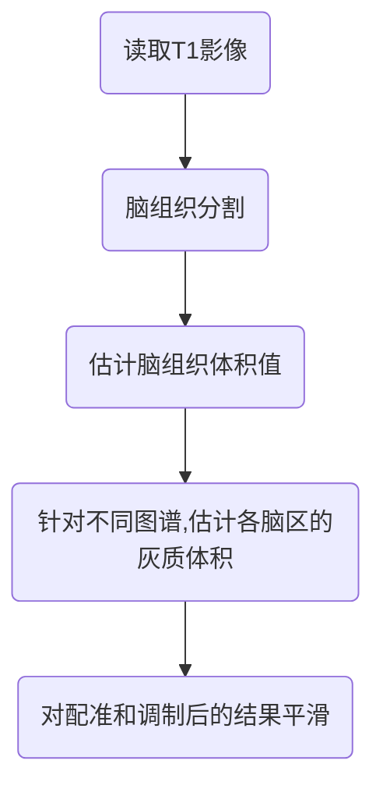

基于表面的脑形态学（Surface-based Morphometry, SBM）分析算法可以对结构像进行预处理（提取脑组织、图像校正、灰白质分割等），完成皮层表面重建（得到灰质、白质、脑脊液交界面），生成基于Desikan-Killiany图谱、Destrieux图谱、DKT图谱、Brainnetome图谱的皮层脑区分区以及基于RB图谱的皮层下结构分区，并给出体积、面积、厚度、曲率、局部沟回指数（LGI）等一系列指标。

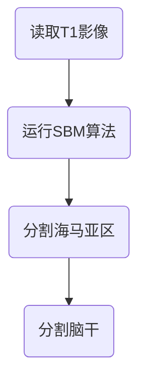
结构像分析：

基于体素的脑形态学纵向分析

基于体素的脑形态学纵向分析算法处理多个时间点的纵向脑结构数据，用于研究脑组织体积在一组人中的改变或多组人群中的改变的差异。结果包括各时间点的脑组织（灰质、白质和脑脊液）分割结果和脑图谱（AAL图谱、Brodmann图谱、Harvard-Oxford图谱、Brainnetome图谱）中各脑区的体积值。

4种脑图谱：

AAL（第一代AAL图谱，116个脑区，包含小脑）

Brodmann（82个脑区）

Harvard-Oxford（112个脑区）

Brainnetome（246个脑区）

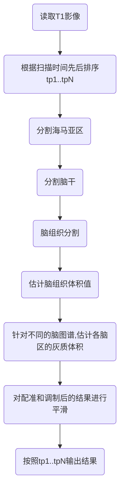

功能像分析
功能像预处理（fMRIPrep）

任务态功能像分析是基于任务态功能磁共振成像（task fMRI）计算单被试对应任务激活的算法。算法根据用户自己上传的任务设计文件以及contrast文件对fMRI图像进行分析处理。分析过程包括fMRI数据预处理以及一般线性模型（GLM）分析两个步骤。
输入：
T1结构像（必选）
功能像（必选）

静息态功能像分析
静息态功能像分析（CPAC）算法可以对结构像和静息态功能像进行预处理（组织分割、图像配准、时间层校正、头动校正、协变量回归、滤波、平滑等）并计算各种指标，如局部一致性(ReHo)、低频波动振幅(ALFF)、分数低频波动振幅(fALFF)、半球功能连接(VMHC)、度中心度(DC)、特征向量中心度(EC)、局部功能连接密度(lFCD)等，还可以生成基于种子点的全脑功能连接图以及基于常见脑图谱（Brodmann、AAL、Harvard-Oxford、Brainnetome图谱等）和用户自定义脑图谱的全脑功能连接网络。
 输入
T1结构像（必选）
功能像（必选）

任务态功能像分析
任务态功能像分析是基于任务态功能磁共振成像（task fMRI）计算单被试对应任务激活的算法。算法根据用户自己上传的任务设计文件以及contrast文件对fMRI图像进行分析处理。分析过程包括fMRI数据预处理以及一般线性模型（GLM）分析两个步骤。
输入
fMRI原始图像，必须，至少选择一个run的fMRI数据，支持多个run输入。
3D T1加权像（非必须），用于空间标准化。

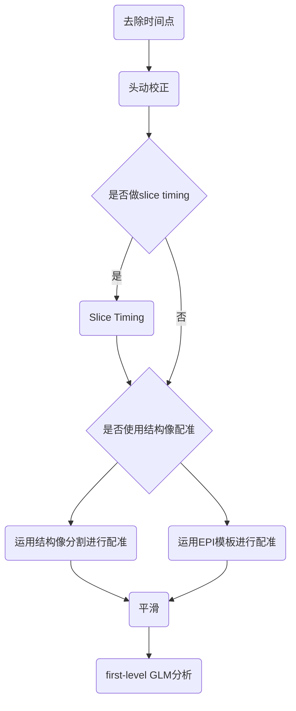

任务态功能像分析（fMRIPrep）
任务态功能像分析（基于fMRIPrep）是采用fMRIPrep对任务态功能磁共振图像进行数据预处理，然后采用一般线性模型（GLM）对预处理后的图像进行功能激活分析。

组水平独立成分分析
组水平独立成分分析（Group Independent Component Analysis, Group ICA）可以对功能像和结构像进行预处理，并自动去除运动等噪声成分，最终为群组内每个被试生成顺序一致的独立成分。
输入
功能像（必选）
T1结构像（必选）
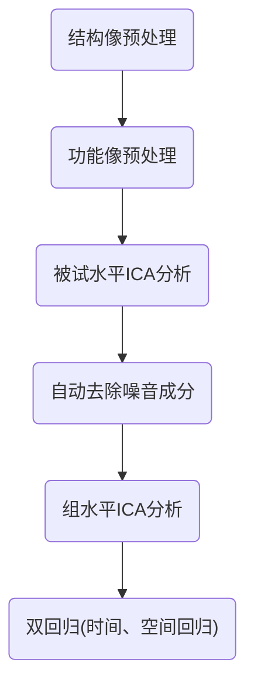

扩散像分析
（MRtrix、DIPY）

扩散像预处理(QSIPrep)
扩散像预处理（QSIPrep）算法对结构像和扩散像进行综合预处理，适用几乎所有的 b 值设计方式。 预处理步骤包括图像信息确认、去噪、形变校正、头动校正、空间标准化等。
输入
DWI 图像（必选）
T1 加权结构像（必选）
相位编码方向相反的 b0 图像（可选）

DTI参数分析
DTI 是分析扩散张量成像（Diffusion tensor imaging, DTI）模型参数的算法。 数据经过预处理后，首先计算 FA、MD、AD、RD 等 DTI 模型的参数图像； 再将所有参数图像配准到标准模板，得到标准空间下的参数图； 根据脑白质模板计算各白质区域的参数平均值。 若选择 TBSS 处理，则用非线性配准方法将所有被试的 FA 图像配准到同一空间。 在平均 FA 图像上提取 FA 骨架，这个骨架代表这组被试纤维束的中心位置。 将每个被试的参数图重新投射到这个 FA 骨架上，得到每个被试的纤维束骨架参数图。
输入
DWI 图像
3D T1 加权像（非必须），用于空间标准化

DKI参数分析
DKI 是分析扩散峰度成像（Diffusion kurtosis imaging, DKI）模型参数的算法。 数据经过预处理后，首先计算 MK、AK、RK、FA、MD、AD、RD 等 DKI 模型的参数图像； 再将所有参数图像配准到标准模板，得到标准空间下的参数图； 根据脑白质模板计算各白质区域的参数平均值。 若选择 TBSS 处理，则用非线性配准方法将所有被试的 FA 图像配准到同一空间。 在平均 FA 图像上提取 FA 骨架，这个骨架代表这组被试纤维束的中心位置。 将每个被试的参数图重新投射到这个 FA 骨架上，得到每个被试的纤维束骨架参数图。

输入
DWI 图像，必须是多b值shell类数据
3D T1 加权像（非必须），用于空间标准化

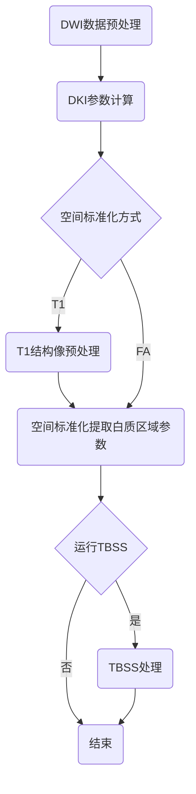

DSI参数分析
DSI 是分析扩散谱成像（Diffusion spectrum imaging, DSI）数据的算法。 数据经过预处理后，首先计算 DSI、MAP 模型的 GFA、 rtop_signal 等参数图像； 再将所有参数图像配准到标准模板，得到标准空间下的参数图； 根据脑白质模板计算各白质区域的参数平均值。 若选择 TBSS 处理，则用非线性配准方法将所有被试的 FA 图像配准到同一空间。 在平均 FA 图像上提取 FA 骨架，这个骨架代表这组被试纤维束的中心位置。 将每个被试的参数图重新投射到这个 FA 骨架上，得到每个被试的纤维束骨架参数图。
输入
DWI 图像，DSI 属于非shell类数据
3D T1 加权像（非必须），用于空间标准化

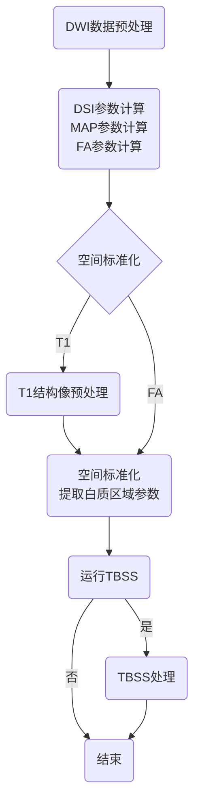

IVIM参数分析
IVIM 是分析体素内不相干运动（Intravoxel incoherent motion，IVIM）模型参数的算法。 数据经过预处理后，首先计算 perfusion_fraction、D_star、D 等 IVIM 模型的参数图像； 再将所有参数图像配准到标准模板，得到标准空间下的参数图； 根据脑白质模板计算各白质区域的参数平均值。 若选择 TBSS 处理，则用非线性配准方法将所有被试的 FA 图像配准到同一空间。 在平均 FA 图像上提取 FA 骨架，这个骨架代表这组被试纤维束的中心位置。 将每个被试的参数图重新投射到这个 FA 骨架上，得到每个被试的纤维束骨架参数图。
输入
DWI 图像，IVIM 需要多b值，一般是非shell类数据
3D T1 加权像（非必须），用于空间标准化

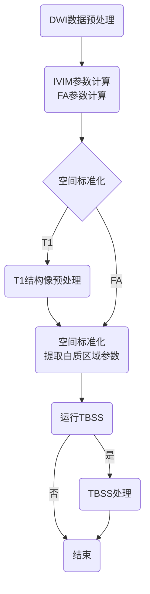

NODDI参数分析

NODDI 是分析神经突方向离散度与密度成像（Neurite orientation dispersion and density imaging，NODDI）模型参数的算法。 数据经过预处理后，首先计算 Vic、Viso、ODI 等 NODDI 模型的参数图像； 再将所有参数图像配准到标准模板，得到标准空间下的参数图； 根据脑白质模板计算各白质区域的参数平均值。 若选择 TBSS 处理，则用非线性配准方法将所有被试的 FA 图像配准到同一空间。 在平均 FA 图像上提取 FA 骨架，这个骨架代表这组被试纤维束的中心位置。 将每个被试的参数图重新投射到这个 FA 骨架上，得到每个被试的纤维束骨架参数图。
输入
DWI 图像，必须是多b值shell类数据
3D T1 加权像（非必须），用于空间标准化

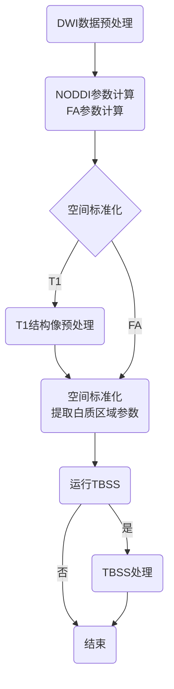

DTI确定性纤维束追踪
DTI 确定性纤维束追踪 是使用纤维束追踪计算结构连接的算法。 全脑会根据模板划分为各个脑区， 纤维束追踪踪结果用于计算各个脑区的结构连接。 默认情况下计算模板内各脑区间的连接，得到结构连接矩阵。 也可以单独上传一个种子区，计算它到各脑区的结构连接。

输入
DWI 图像，必须是shell类数据
3D T1 加权像，用于空间标准化
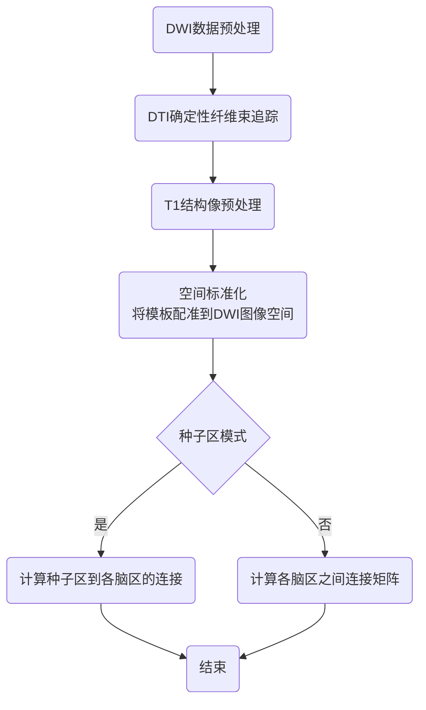

DTI概率性纤维束追踪
DTI 概率性纤维束追踪 是使用纤维束追踪计算结构连接的算法。 全脑会根据模板划分为各个脑区， 纤维束追踪踪结果用于计算各个脑区的结构连接。 默认情况下计算模板内各脑区间的连接，得到结构连接矩阵。 也可以单独上传一个种子区，计算它到各脑区的结构连接。
输入
DWI 图像，必须是shell类数据
3D T1 加权像，用于空间标准化
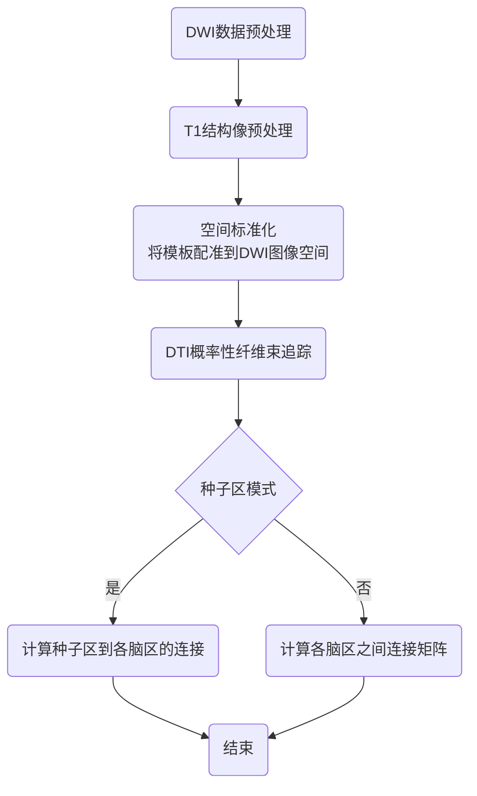

DSI确定性纤维束追踪
DSI 确定性纤维束追踪 是使用纤维束追踪计算结构连接的算法。 全脑会根据模板划分为各个脑区， 纤维束追踪踪结果用于计算各个脑区的结构连接。 默认情况下计算模板内各脑区间的连接，得到结构连接矩阵。 也可以单独上传一个种子区，计算它到各脑区的结构连接。
输入
DWI 图像，DSI 属于非shell类数据
3D T1 加权像，用于空间标准化

自动纤维束量化分析
自动纤维束量化分析 (Automated fiber quantification, AFQ) 是自动、分析识别纤维束的算法。 数据经过预处理后，计算DTI确定性纤维束追踪，得到全脑纤维束； 根据已知的解剖结构设置纤维束的起止区域，寻找主要纤维束； 然后对纤维束进行清理，排除假的连接； 最后沿着纤维束方向提取 100 个点的扩散参数的值。
输入
DWI 图像
3D T1 加权像，用于空间标准化

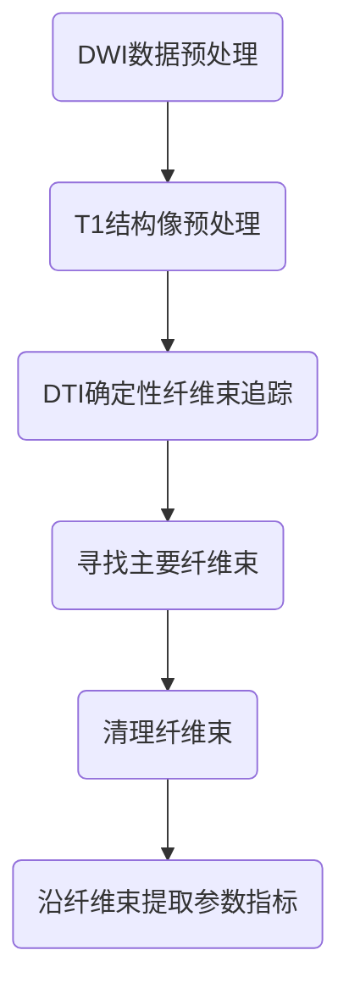

分数化运动模型
FM 是分析分数化运动（Fractional motion, FM）扩散模型参数的算法。 数据经过预处理后，计算 alpha、hurst 等 FM 参数图像。
输入
DWI 图像，由特殊序列采集

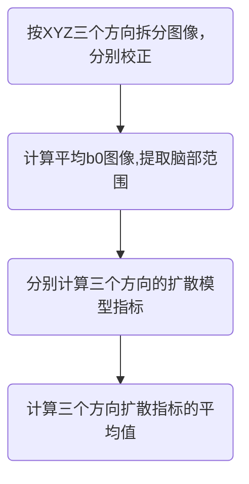

灌注像(perfusion)分析
ASL脑血流分析
ASL脑血流分析是根据特定的ASL数据计算全脑脑血流（CBF）值的算法。目前，该算法支持PASL（包括2D PICORE和3D FAIR两种ASL成像方式）以及3D PCASL的CBF相关计算。

输入
ASL成像的原始图像（必选）。
3D T1加权像（非必需），用于做空间标准化，如果没有T1像，则不进行空间标准化。
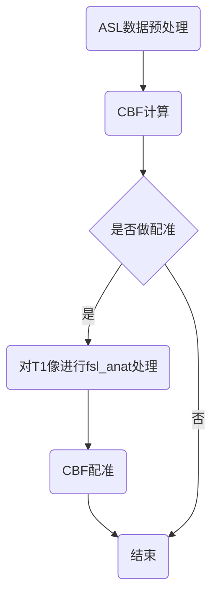

组分析算法
- 统计分析
  - 影像统计分析
    - 用户可以针对选取的个体水平分析结果，执行统计分析以及多重比较校正。
  - GLM分析
    - 对单被试分析的影像结果，进行组水平的一般线性模型（GLM）分析
  - SBM统计分析
    - 对SBM中重建好的皮层指标图像进行统计分析和多重比较校正。
  - VBM纵向统计分析
    - 使用flexible factorial design模型完成纵向统计分析分析。
  - 脑网络图论属性分析
    - 利用基于图论的复杂脑网络分析理论，计算结构连接网络、功能连接网络的拓扑属性，其结果包含节点属性（Clustering Coefficient、Shortest Path Length、Efficiency、Local Efficiency、Degree Centrality、Betweenness Centrality、Community Index）和全局属性（Small-World、Efficiency、Rich-Club、Assortativity、Synchronization、Hierarchy）。
  - 结构协变网络统计分析
    - 对两组人群的大脑形态学指标做基于群组的结构协变网络分析，计算多种包括全局和结点的网络属性，并通过permutation的方法计算两组的差异显著性。

算法流程图、输入介绍、参数介绍、结果介绍

生理（MEG EEG）、结构像相关数据分析开源库

FOOOF：是一种快速、高效的分析工具，用于神经功率谱的参数估计。可用于测量电生理数据的周期性和非周期性特性，包括EEG、MEG、ECoG和LFP数据。使用FOOOF测量假定振荡的好处是，功率谱中的峰值以其特定的中心频率、功率和带宽为特征，而不需要预先定义特定的感兴趣频带和控制非周期性成分。FOOOF还可以测量信号的这种非周期性成分，允许测量和比较被试内和被试间的1/f类分形信号。
网址：https://github.com/fooof-tools/

Spectral Connectivity：是一个python软件包，使用多锥傅里叶变换计算频域大脑的连通性，如相干性、频谱格兰杰因果关系和相位滞后指数，可以有效地从多电极记录中总结大脑区域水平的相干性。它旨在一次处理多个时间序列，能够缓存频繁计算的量，例如交叉谱矩阵和最小相位分解，以便使用相同处理步骤的连通性测量可以更快地计算出来。它解耦了时频变换和连通性测量，如果你已经有计算傅立叶系数的首选方法（即小波变换），则可以使用它来代替。
网址：https://github.com/Eden-Kramer-Lab/spectral_connectivity

PACTools：用于估计神经时间序列中的相位幅值耦合(PAC)的工具。
网址：https://github.com/pactools/pactools

Tensor PAC：Tensor PAC是一个开源Python工具箱，使用张量和并行计算来获得相位幅值耦合(PAC)。它允许将现有的测量PAC和随机分布的方法结合起来，使用Einstein求和，其中PAC的实现是为了支持多维数组（即张量）。这种类型的实现可以大大降低计算成本。

网址：https://github.com/EtienneCmb/tensorpac

SEREEGA：SEREEGA(Simualating Event-Related EEG Activity)是一个基于MATLAB的开源工具箱，用于生成模拟的、事件相关的EEG数据。SEREEGA旨在作为一种工具，以已知的真实情况生成的数据来评估神经科学和信号处理方法，例如盲源分离、源定位、连通性测量、脑机接口分类器精度等等。

网址：https://github.com/lrkrol/SEREEGA

PyEEG：一个用于EEG特征提取的开源Python模块，可实现神经时间序列的信息论和复杂性的相关测量。网址：https://github.com/forrestbao/pyeeg

OpenMEEG：低频生物电磁的c++包，可用于解决EEG和MEG领域的正演问题。网址：https://github.com/openmeeg/openmeeg

NutMEG：NutMEG（Neurodynamic Utility Toolbox for Magnetoencephalo-and Electroencephalo-Graphy）是一个非常实用的MEG/EEG分析工具箱，由UCSF 生物磁成像实验室开发，用于重建神经激活的时空动态并将它们叠加到结构MR图像上。该工具箱在MATLAB下与SPM8结合运行，可在Linux/UNIX、Mac OS X，以及Windows系统上使用。

网址：https://www.nitrc.org/plugins/mwiki/index.php/nutmeg:MainPage

https://zhuanlan.zhihu.com/p/550123981

大牛网站主页：
 
http://alexandre.gramfort.net/
https://larsoner.com/
https://andysbrainbook.readthedocs.io/en/latest/AFNI/AFNI_Short_Course/AFNI_fMRI_Intro.html
https://www.andysbrainblog.com/

脑影像软件相关资源
https://zhuanlan.zhihu.com/p/550123981

https://github.com/PennLINC/qsiprep 
https://qsiprep.readthedocs.io/en/latest/preprocessing.html

https://github.com/MICA-MNI/BrainSpace